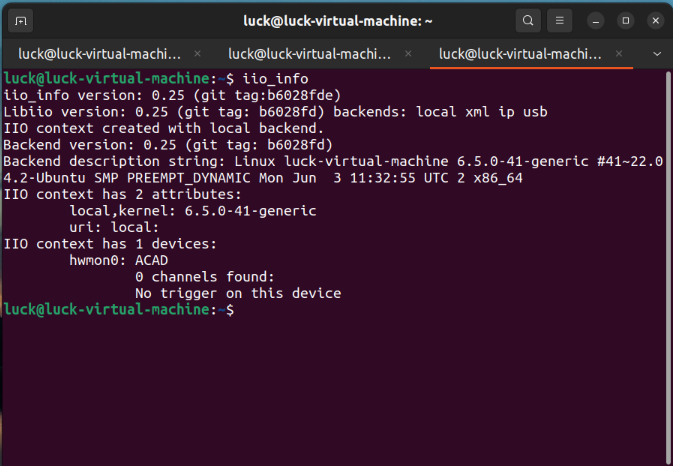
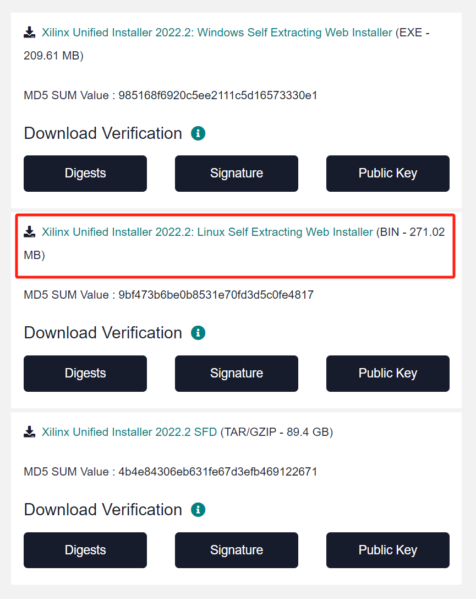
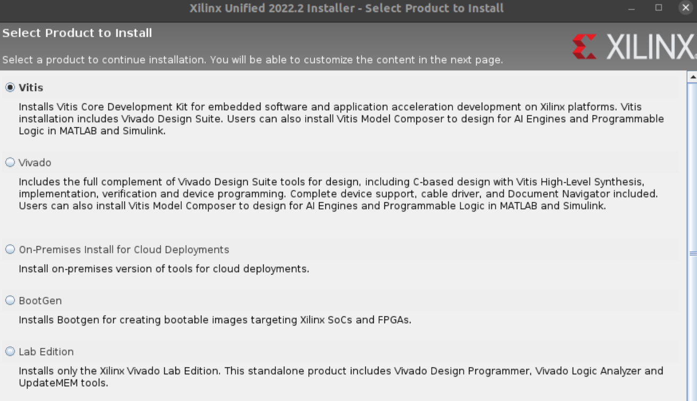
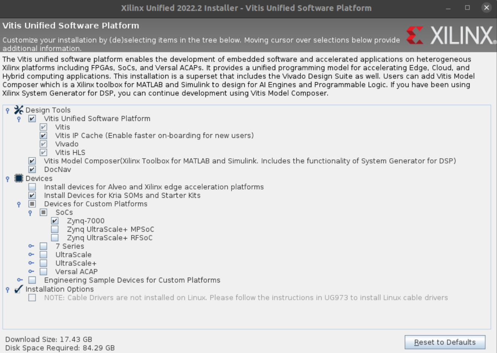
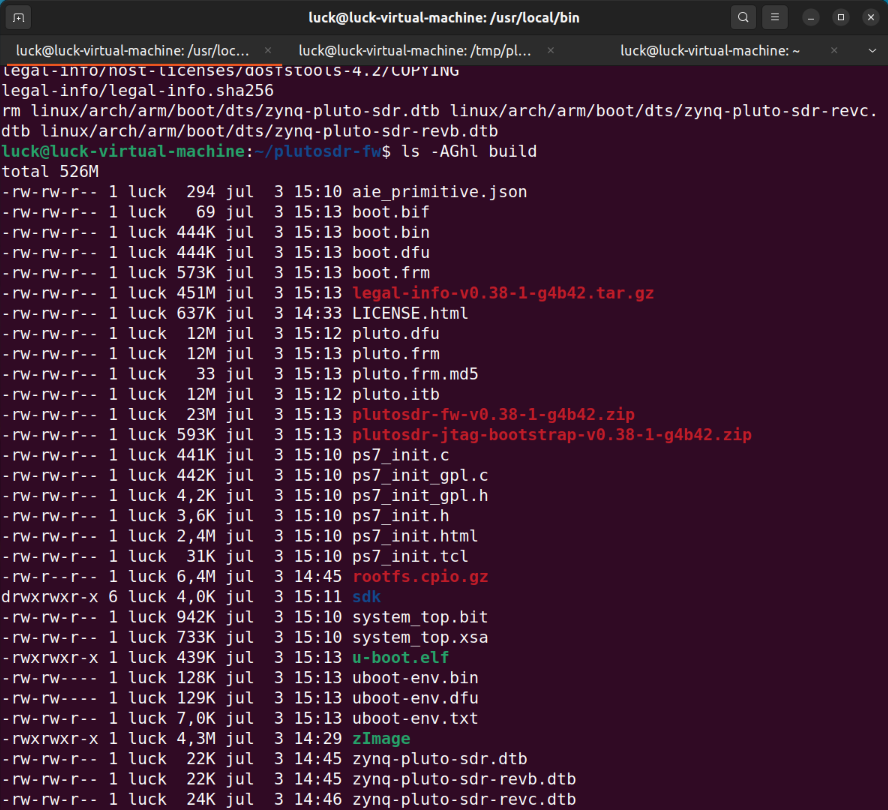
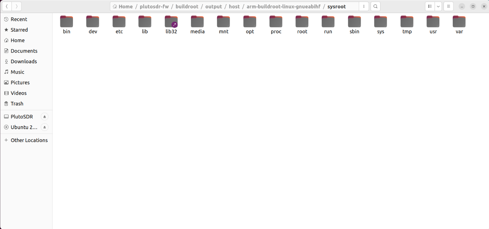
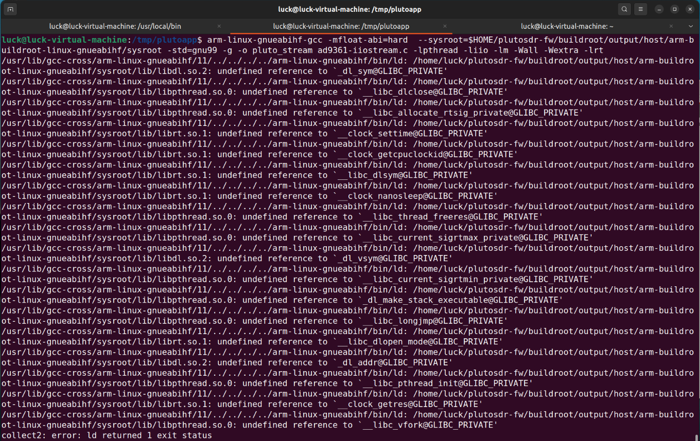
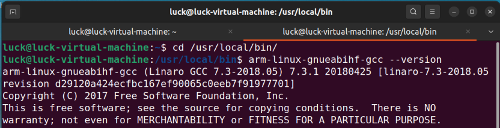
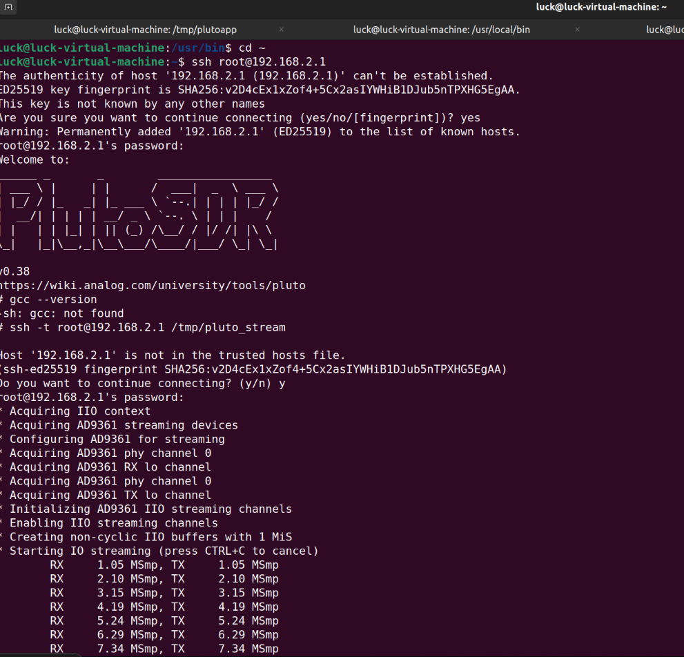
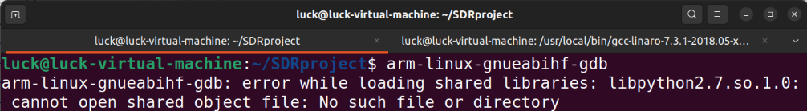

# SDR configuration - Ubuntu (Windows VMware)
## 0. Setup
1. VMware 17.5.1
2. Ubuntu 22.04

<font color=red>
Notice: 
While allocating the Hard Disk for Ubuntu, it is better to be >90 GB (for Vivado Vitis install) 
</font>
  
## 1. Install references
```bash
sudo apt-get install build-essential libxml2 libzstd-dev libxml2-dev bison flex libcdk5-dev cmake libaio-dev libusb-1.0-0-dev libserialport-dev libxml2-dev libavahi-client-dev doxygen graphviz
```

## 2. Get the libiio
```bash
git clone https://github.com/analogdevicesinc/libiio.git --branch v0.25
cd libiio
mkdir build
cd build
cmake ..
make -j$(nproc)
sudo make install
sudo ldconfig
cd ../..
```
</td></tr></table>
  
Type <font color=red>iio_info</font>, if output the version information, it means installed correctly.
https://chromium.googlesource.com/chromiumos/third_party/libiio/+/a6e4fcf8d54824bf59dc1f5acb952ead9ff1228b/README_BUILD.md 
  

  
## 3. insatll libad9361-iio
```bash
git clone https://github.com/analogdevicesinc/libad9361-iio.git
cd libad9361-iio
cmake .
make -j$(nproc)
sudo make install
sudo ldconfig
cd ..
```
  
  
# Compile Pluto SDR firmware (plutosdr-fw) for cross-compile (syroot)
## 1. Get the firmware
```bash
git clone --recursive https://github.com/analogdevicesinc/plutosdr-fw.git
```
<font color=red>Notice</font>:
<font color=red>--recursive</font>  must be included to get the complete source.
  
<font color = red>
Notice:

For ***sysroot firmware, it is better to compile it locally via Vivado, rather than directly download from official website***, otherwise it would have lots of problems: such as ... undefined reference ....
</font>

## 2. Check which version of Vivado is needed for the corresponding plutosdr-fw
```bash
cd plutosdr-fw
  
grep -i REQUIRED_VIVADO_VERSION $(find ./ -name "adi*.tcl") | grep set
```
If get the output information like:
```bash
set required_vivado_version "2022.2"
```
it means Vivado 2022.2 version Vitis is needed.
  
## 3. Preparation for Vivado Vitis
<font color=red>Otherwise, the installation of Vivado Vitis will got stuck in final processing (i.e. generating installed devie list)</font>
```bash
sudo apt-get install libtinfo5
  
sudo apt install libncurses5
```
  
## 4. Vivado Vitis installation
### 4.1 Download the corresponding version (i.e., Section 2) of Vivado Vitis
https://www.xilinx.com/support/download/index.html/content/xilinx/en/downloadNav/vitis/archive-vitis.html
Choose<font color=red> Xilinx Unified Installer 2022.2: Linux Self Extracting Web Installer(BIN - 271.02 MB)</font>
  

  
The downloaded file is an online installer, change the access permission
```bash
chmod +x ./Xilinx_Unified_2022.2_1014_8888_Lin64.bin
  
./Xilinx_Unified_2022.2_1014_8888_Lin64.bin
```
  
### 4.2 Install
Then the installer will be activated. Sign in with Xilinx account, choose the first one: Vitis

  
Choose the necessary parts

  
<font color=red>
Notice:
Disk Space Required: 84.29 GB
</font>
  
  
Install path is recommended to be in /opt/Xilinx/:
```bash
sudo mkdir /opt/Xilinx/
  
sudo chmod 777 /opt/Xilinx/
```
<font color=red>Notice:
Make sure change the access permission of the folder (/opt/Xilinx/)
</font>
  
## 5. Install running library
```bash
sudo apt-get install git build-essential ccache device-tree-compiler dfu-util fakeroot help2man libncurses5-dev libssl1.0-dev mtools rsync u-boot-tools bc python cpio zip unzip file wget libmpc-dev libgmp-dev
```
  
## 6. Set the environment variables
```bash
export CROSS_COMPILE=arm-linux-gnueabihf-
  
export PATH=$PATH:/opt/Xilinx/Vitis/2022.2/gnu/aarch32/lin/gcc-arm-linux-gnueabi/bin
  
export VIVADO_SETTING=/opt/Xilinx/Vivado/2022.2/settings64.sh
```
  
## 7. Start to compile
Make sure the computer can access the Internet successfully, go the the root of the source code (i.e. /plutosdr-fw), run
```bash
make
```
Then it will start to running, the terminal will have lots of output, after nearly half an hour, no error occur, then run 
```bash
ls -AGhl build
```
If get the corresponding file structure, it means the compile success!

  
## 8. Get syroot (used for cross-compile)
In folder:
```
/plutosdr-fw/buildroot/output/host/arm-buildroot-linux-gnueabihf/sysroot/ 
```
we can find the on-board Linux root directory.

We can compile our code base on <font color=red>this PATH</font>, to make the compiled file running on Pluto SDR standalone.
  
# Cross compile and upload to PlutoSDR to make the project work standalone
## 1. Install Linaro tool-chain
Go to Linaro download website, check and download the corresponding file, which is suitable for the local machine. 
https://releases.linaro.org/components/toolchain/binaries/7.3-2018.05/arm-linux-gnueabihf/
  
```bash
wget https://releases.linaro.org/components/toolchain/binaries/7.3-2018.05/arm-linux-gnueabihf/gcc-linaro-7.3.1-2018.05-x86_64_arm-linux-gnueabihf.tar.xz
sudo cp gcc-linaro-7.3.1-2018.05-x86_64_arm-linux-gnueabihf.tar.xz /usr/local/bin/
cd /usr/local/bin/
sudo tar -xf gcc-linaro-7.3.1-2018.05-x86_64_arm-linux-gnueabihf.tar.xz
sudo nano ~/.bashrc
```
Add this line of command to the end of file (~/.bashrc), save, exit
```
export PATH=$PATH:/usr/local/bin/gcc-linaro-7.3.1-2018.05-x86_64_arm-linux-gnueabihf/bin
```
```bash
source ~/.bashrc
```
  
<font color=red>
Notice:
It is better NOT directly download and install via command
</font>
  
```bash
sudo apt install gcc-arm-linux-gnueabihf
```
Otherwise, we will meet with problems while cross-compiling the code, such as

  
Verifying if the installation was successful:
```bash
arm-linux-gnueabihf-gcc --version
```
It will show:

  
## 2. Prepare code and cross-compile
### 2.1 Taking the test project from official website (ad9361-iiostream.c)
```bash
mkdir /tmp/plutoapp
cd /tmp/plutoapp
wget https://raw.githubusercontent.com/analogdevicesinc/libiio/libiio-v0/examples/ad9361-iiostream.c
```
  
### 2.2 Cross-compile
```bash
arm-linux-gnueabihf-gcc -mfloat-abi=hard  --sysroot=$HOME/plutosdr-fw/buildroot/output/host/arm-buildroot-linux-gnueabihf/sysroot -std=gnu99 -g -o pluto_stream ad9361-iiostream.c -lpthread -liio -lm -Wall -Wextra -lrt
```

<font color=red>
Notice: 
Make sure the PATH to sysroot is correct. 
</font>
  
pluto_stream is the name for the generated (cross-compiled) file.
  
## 3. Upload the file to Pluto SDR, running the file on Pluto SDR
### 3.1 Copy the generated file to Pluto SDR system
```bash
scp pluto_stream root@192.168.2.1:/tmp/
```
  
### 3.2 Run the uploaded file
```bash
ssh -t root@192.168.2.1 /tmp/pluto_stream
```
We can see:

  
  
# Totally offline running: supply power, automatically run the deployed file
## 1. Go to check Pluto SDR /etc/init.d/
```
cd /etc/init.d/
```
There is a file <font color=blue>S98autorun</font>.
Open it and we can see, for Pluto SDR, once supplying the power, and starting up, it will check whether there is <font color=blue>autorun.sh</font> file under the path /mnt/jffs2/, if yes, it will automatically run this file and call the corresponding exacable files.
  
Put the cross-compile and uploaded file to the same path as /mnt/jffs2, otherwise, everytime restart the Pluto SDR, files uploaded to other places would be deleted. 
  
Go to /mnt/jffs2 and generate an <font color=blue>autorun.sh</font> file.
  
```
vi /mnt/jffs2/autorun.sh 
/mnt/jffs2/sine &
```
<font color=red>
Notice:
  
Make sure the access permission of uploaded file.
</font>
chmod +x /mnt/jffs2/sine
chmod +x /mnt/jffs2/autorun.sh
  
  
  
  
# Configure GDB and GDB server for debugging
## Prepare GDB for local machine
1. install 'arm-linux-gnueabihf' toolchain 
```bash
sudo apt install gdb-multiarch
sudo apt install gcc-arm-linux-gnueabihf g++-arm-linux-gnueabihf
```
<font color=red> Notice:
Once install gcc-arm-linux-gnueabihf; g++-arm-linux-gnueabihf directly through command line, the system will automatically configure the default gcc-arm-linux-gnueabihf; g++-arm-linux-gnueabihf version according to this command line configured one. Then it will make problems while doing cross-compile, such as:
</font>

  
<font face="Optima" color=red>Solutions：
Change the configuration of environment variables:
</font>
```bash
# open and edit .bashrc
nano ~/.bashrc 
```
  
Add the command to the end of the file. 
(1) If doing cross-compile, put the information of specific version of compiler in front of PATH 
```bash
export PATH=/usr/local/bin/gcc-linaro-7.3.1-2018.05-x86_64_arm-linux-gnueabihf/bin:$PATH
```
(2) If start the gdb, gdbserver debugging, put the information of specific version of compiler at end of PATH 
```bash
export PATH=$PATH:/usr/local/bin/gcc-linaro-7.3.1-2018.05-x86_64_arm-linux-gnueabihf/bin
```
(3) reload  ~/.bashrc
```bash
source ~/.bashrc
```
  
## Prepare GDB Server for Pluto SDR
1. copy the gdbserver to Pluto SDR
```bash
scp /usr/local/bin/gcc-linaro-7.3.1-2018.05-x86_64_arm-linux-gnueabihf/arm-linux-gnueabihf/libc/usr/bin/gdbserver root@192.168.2.1:/bin
``` 
  
2. Check the version of gdbserver
Using ssh to login to Pluto SDR, then check the version information of gdbserver, make sure the version of GDB and GDB server keep the same.
```bash
gdbserver --version
```
  
## Start the gdbserver (board-side)
Go to the path of uploaded file, e.g., /tmp, and start gdbserver
```bash
cd /tmp
gdbserver :1234 ./sineWave   % 1234: the port to be used for Pluto and Ubuntu
```
## Start the gdb (local machine-side)
1. Typing "arm-linux-gnueabihf-gdb"
```bash
arm-linux-gnueabihf-gdb
```
There maybe show error informaiton as follow:

  
2. Install the required lib
```bash
sudo apt install libpython2.7
```
  
Then, it can work...
  
## Remote debugging
1. Go to the directoary of cross-compiled uploaded file
```bash
arm-linux-gnueabihf-gdb
```
  
2. remote connect and debug
```gdb
(gdb) file sineWave
target remote 192.168.2.1:1234
```

Note: This repository was inspired by related technical articles and received technical support from the Analog Devices Forum, as well as other sources.
